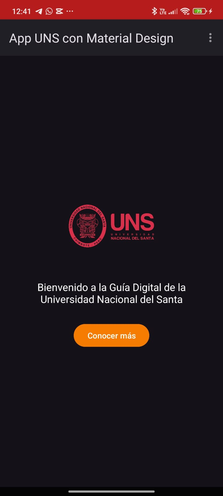
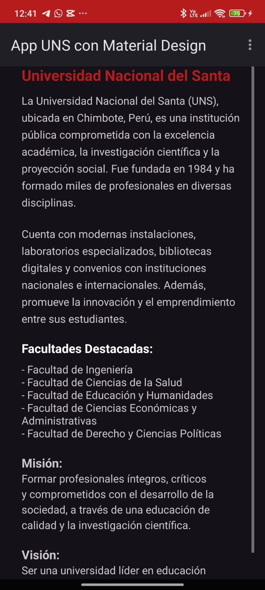
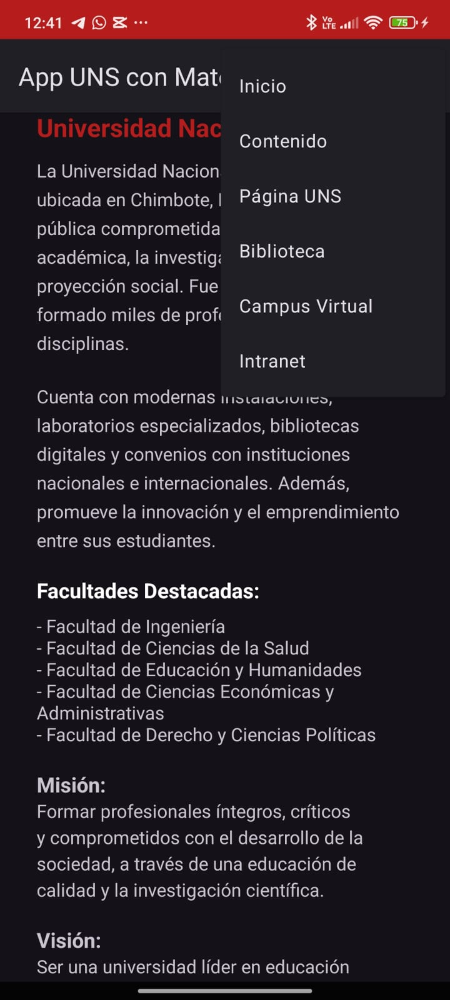
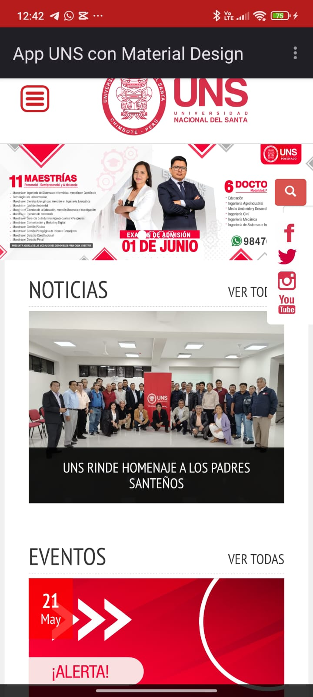
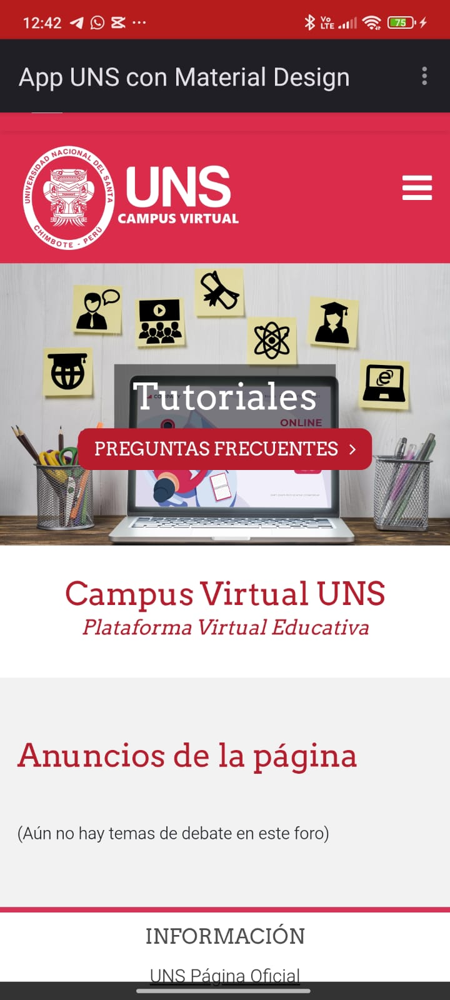
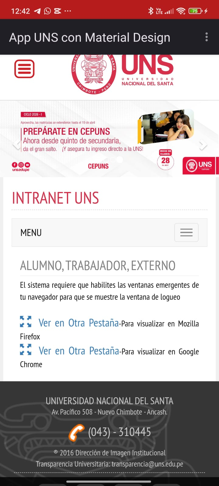

# S8Briceno MaterialDesign WebView Menu – App Movil con Navegación web a traves de WebViews con Material Design y Menú emergente

`S8Briceno_MaterialDesign_WebView_Menu` es una aplicación móvil Android desarrollada en Kotlin como parte del curso de Aplicaciones Móviles. Este proyecto demuestra el uso de **Material Design 3**, un componente **WebView** para mostrar páginas web dentro de la app, y un **menú emergente** texto.

La aplicación permite al usuario acceder rápidamente a una página institucional o de interés, todo desde una interfaz limpia, moderna y compatible con temas claros y oscuros. Además, incorpora un botón que despliega un menú emergente con opciones funcionales, mejorando la experiencia del usuario.

Este trabajo fue elaborado como parte de la Semana 8 del curso, con el objetivo de integrar diversos componentes visuales y funcionales en la app.

---

## 📸 Capturas de pantalla

| 🌐 **Inicio** | 📋 **Información** |
|----------------|----------------------|
|  |  |

| 📋 **Menú de Opciones** | 🌐 **WebView – Página UNS** |
|----------------|----------------------|
|  |  |

| 🌐 **WebView – Campus Virtual** | 🌐 **WebView – Intranet** |
|----------------|----------------------|
|  |  |
---

## 📱Características

- Visualización de sitios web desde la app (WebView).
- Menú emergente con texto indicando que es.
- Interfaz basada en los principios de Material Design 3.
- Navegación sencilla y moderna.

---

## 🛠️ Tecnologías utilizadas

- Kotlin
- Android Studio Flamingo o superior
- Material Components (`1.12.0`)
- WebView
- PopupMenu
- ThemeOverlay.Material3
- XML Layouts
